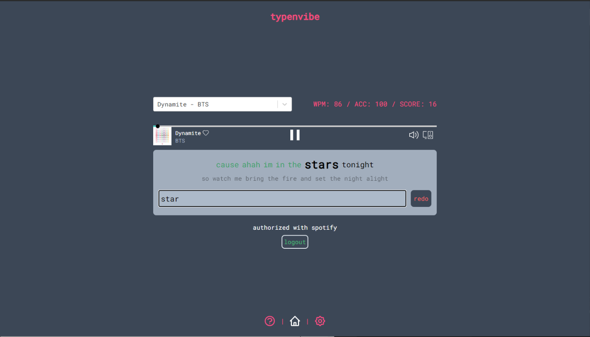
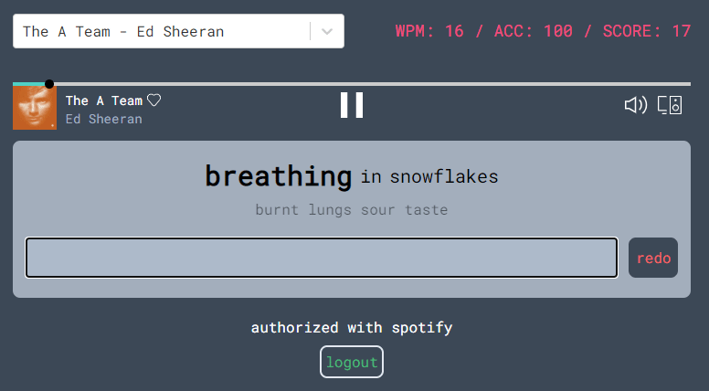
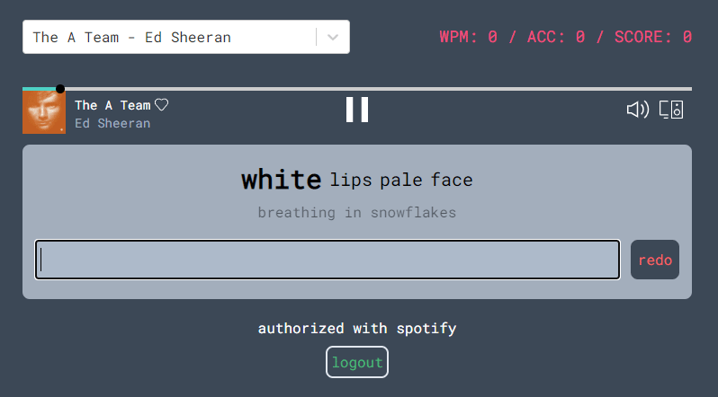

<!-- PROJECT LOGO -->
<br />
<p align="center">
  <a href="https://github.com/j0hnk1m/typenvibe">
    
  </a>

  <h2 align="center">typenvibe</h2>

  <p align="center">
    a web app to practice typing in rythm with your favorite songs
    <br />
    <a href="https://typenvibe.com"><strong>Visit the site »</strong></a>
    <br />
  </p>

  <p align="center">
    <a href="https://typenvibe.com">
      
    </a>
    <a href="https://github.com/j0hnk1m/typenvibe/network/members">
      
    </a>
    <a href="https://github.com/j0hnk1m/typenvibe/stargazers">
      
    </a>
    <a href="https://github.com/j0hnk1m/typenvibe/issues">
      
    </a>
    <a href="./LICENSE.md">
      
    </a>
  </p>

  <p align="center">
    <a href="https://github.com/j0hnk1m/typenvibe/blob/master/README.md">View Docs</a>
    ·
    <a href="https://github.com/j0hnk1m/typenvibe/issues">Report Bug</a>
    ·
    <a href="https://github.com/j0hnk1m/typenvibe/issues">Request a Feature</a>
  </p>
</p>


## Table Of Contents <!-- omit in toc -->

- [:zap: About](#zap-about)
  - [Overview](#overview)
  - [How to...](#how-to)
  - [Built With](#built-with)
  - [Infrastructure](#infrastructure)
- [:rocket: Getting Started](#rocket-getting-started)
- [:fire: Documentation](#fire-documentation)
- [:earth_africa: Roadmap](#earth_africa-roadmap)
- [:wink: Contributing](#wink-contributing)
- [:memo: License](#memo-license)
- [:email: Contact](#️email-contact)
- [:loudspeaker: Acknowledgements](#loudspeaker-acknowledgements)
- [:dollar: Donations](#dollar-donations)


<!-- ABOUT THE PROJECT -->
## :zap: About

<p class="image">
  <a href="https://typenvibe.netlify.app">
    
  </a>
  <p align="center">main page</p>
</p>
<br />


### Overview
The objective of the game is to type the lyrics in rythm to the song. The line that you can type will automatically change in accordance to the timing of the song (unless you are in "chill" mode, which you can configure in settings).


### How to...
1) Choose music service (available: Spotify, coming 
  soon: Youtube, Apple Music, SoundCloud), to use.

2) After being authorized, select choice from the 
  list of songs.

3) Click the typing input box. Now, just type any 
  key to start the song! You will only be allowed 
  to type when the artist is on the same timeframe, 
  meaning that input is disabled well before and 
  after the artist has sung that line. Note: starting 
  the song by clicking the play button will mess up 
  the sync between the audio and lyrics!


### What happens on a line change?
If the line changes while you are typing, never fear, you have the option to type either:

<p class="image" align="center">
  
  <p align="center">1) the word you were going to type before</p>
</p>

<br />

<p class="image" align="center">
  
  <p align="center">... or 2) the new word</p>
</p>

Notice above that the accuracy stays at 100% in both cases. In case you still type wrong, something called the Levenshtein distance is computed for both possibilities in order to determine what you were trying to type. Now type n vibe away!


### Settings
- color themes (most are inspired by GMK keycap sets)
- "chill" mode
  - If you don't want to feel the pressure of typing the lyrics in a time crunch, that's perfectly fine! Enabling chill mode gives the freedom of when you can type back to you, and the lyrics will not automatically change. 
- uppercase (includes uppercase letters in the lyrics)
- punctuation (includes punctuation in the lyrics)


### Built With
<p align="center">
  <a href="https://reactjs.org/">
    
  </a>
  <a href="https://www.gatsbyjs.com">
    
  </a>
  <a href="https://tailwindcss.com/" target="_blank">
    
  </a>
</p>

* ReactJS
* Gatsby
* Tailwindcss
* a lot of coffee and thai tea


### Data
Currently, the lyrics (lrc) files are stored in a private S3 bucket. As for audio, we initially started out with mp3 files, then moved over to youtube links. Since there were bound to be copyright issues, we have moved over and integrated our site with Spotify.

<!-- GETTING STARTED -->
## :rocket: Getting Started

1.  **Install requirements**

    * npm  : Download Node.js and npm from the [official website](https://www.npmjs.com/get-npm)
    * yarn: Follow instructions [here](https://classic.yarnpkg.com/en/docs/install)
    * gatsby
      * ```shell
         npm install -g gatsby-cli
         ```
      * ```shell
         yarn global add gatsby-cli
         ```

2.  **Start developing.**

    Clone the repo and navigate into the frontend directory to start it up.

    ```shell
    git clone https://github.com/j0hnk1m/typenvibe.git
    cd typenvibe/frontend
    yarn install
    gatsby develop
    ```


<!-- USAGE EXAMPLES -->
## :fire: Documentation
Please refer to the [documentation](https://example.com)


<!-- ROADMAP -->
## :earth_africa: Roadmap

See the [open issues](https://github.com/j0hnk1m/typenvibe/issues) for a list of proposed features (and known issues).


<!-- CONTRIBUTING -->
## :wink: Contributing

Contributions are what make the open source community such an amazing place to be learn, inspire, and create. Any contributions you make are **greatly appreciated**.

1. Fork the Project
2. Create your Feature Branch (`git checkout -b feature/AmazingFeature`)
3. Commit your Changes (`git commit -m 'Add some AmazingFeature'`)
4. Push to the Branch (`git push origin feature/AmazingFeature`)
5. Open a Pull Request


<!-- LICENSE -->
## :memo: License

Distributed under the MIT License. See `LICENSE` for more information.

For music licensing, we are able to use Spotify's Web Playback SDK and Web API since this project is noncommercial. We also include 
lyrics in the form of an .lrc file gathered from various sources (such as RentAnAdviser and Megalobiz)


<!-- ACKNOWLEDGEMENTS -->
## :loudspeaker: Acknowledgements
* [typings.gg](https://typings.gg) for UI inspiration
* [GitHub Emoji Cheat Sheet](https://www.webpagefx.com/tools/emoji-cheat-sheet)
* [Img Shields](https://shields.io)
* Base logo vector made by [Freepik from Flaticon](https://www.flaticon.com/authors/freepik)
* Lyric data sources (RentAnAdviser, Megalobiz, etc)


## :dollar: Donations
This is free, open-source software. If you guys would like to support the development of future projects or simply appreciate what we built, you can donate below:

<p align="center">
  <a href="https://www.buymeacoffee.com/typenvibe" target="_blank"></a>
</p> 