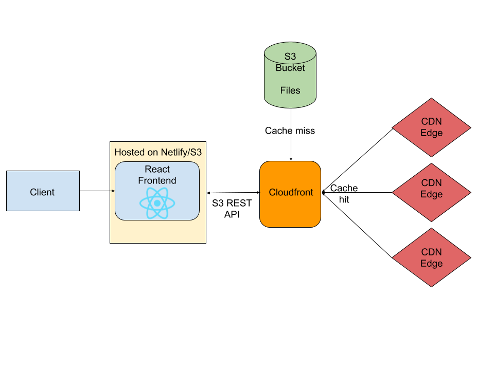

<!-- PROJECT LOGO -->
<br />
<p align="center">
  <a href="https://github.com/othneildrew/Best-README-Template">
    
  </a>

  <h2 align="center">typenvibe</h2>

  <p align="center">
    a web app to practice typing in rythm with your favorite songs
    <br />
    <a href="https://typenvibe.netlify.app"><strong>Visit the site »</strong></a>
    <br />
  </p>

  <p align="center">
    <a href="https://typenvibe.netlify.app">
      
    </a>
    <a href="https://github.com/j0hnk1m/typenvibe/graphs/contributors">
      
    </a>
    <a href="https://github.com/j0hnk1m/typenvibe/network/members">
      
    </a>
    <a href="https://github.com/j0hnk1m/typenvibe/stargazers">
      
    </a>
    <a href="https://github.com/j0hnk1m/typenvibe/issues">
      
    </a>
    <a href="./LICENSE.md">
      
    </a>
  </p>

  <p align="center">
    <a href="https://github.com/j0hnk1m/typenvibe/blob/master/README.md">View Docs</a>
    ·
    <a href="https://github.com/j0hnk1m/typenvibe/issues">Report Bug</a>
    ·
    <a href="https://github.com/j0hnk1m/typenvibe/issues">Request a Feature</a>
  </p>
</p>


## Table Of Contents <!-- omit in toc -->

- [:zap: About](#zap-about)
  - [Built With](#built-with)
  - [Infrastructure](#infrastructure)
- [:rocket: Getting Started](#rocket-getting-started)
- [:fire: Documentation](#fire-documentation)
- [:earth_africa: Roadmap](#earth_africa-roadmap)
- [:wink: Contributing](#wink-contributing)
- [:memo: License](#memo-license)
- [:email: Contact](#️email-contact)
- [:loudspeaker: Acknowledgements](#loudspeaker-acknowledgements)
- [:dollar: Donations](#dollar-donations)


<!-- ABOUT THE PROJECT -->
## :zap: About

<p class="image">
  <a href="https://typenvibe.netlify.app">
    
  </a>
  <p align="center">typenvibe</p>
</p>
<br />

The objective of the game is to type the lyrics in rythm to the song. The lyrics you can type will be constantly updating based on the line that the artist is currently on. If the line changes while you are typing, never fear, you have the option to type either:

<p class="image" align="center">
  
  <p align="center">1) the word you were going to type before</p>
</p>

<br />

<p class="image" align="center">
  
  <p align="center">... or 2) the new word</p>
</p>

Notice above that the accuracy stays at 100% in both cases. In case you still type wrong, something called the Levenshtein distance is computed for both possibilities in order to determine what you were trying to type. Now type n vibe away!

### Built With
<p align="center">
  <a href="https://reactjs.org/">
    
  </a>
  <a href="https://www.gatsbyjs.com">
    
  </a>
  <a href="https://tailwindcss.com/" target="_blank">
    
  </a>
</p>

* ReactJS
* Gatsby
* Tailwindcss
* a lot of coffee and thai tea

### Infrastructure
<p align="center">
  
  <figcaption align="center">web infrastructure</figcaption>
</p>

As the site is still under development and since we are broke college students, the most viable option to store the data (lyrics, mp3 file, etc.) was with Amazon S3. Cloudfront is used as an Origin Access Identity (OAI) to secure the files and allow for faster distribution by using caching and edge locations. Currently, a custom REST API is under development.

<!-- GETTING STARTED -->
## :rocket: Getting Started

1.  **Install requirements**

    * npm  : Download Node.js and npm from the [official website](https://www.npmjs.com/get-npm)
    * yarn: Follow instructions [here](https://classic.yarnpkg.com/en/docs/install)
    * gatsby
      * ```shell
         npm install -g gatsby-cli
         ```
      * ```shell
         yarn global add -g gatsby-cli
         ```

2.  **Start developing.**

    Clone the repo and navigate into the frontend directory to start it up.

    ```shell
    git clone https://github.com/j0hnk1m/typenvibe.git
    cd typenvibe/frontend
    yarn install
    gatsby develop
    ```


<!-- USAGE EXAMPLES -->
## :fire: Documentation
Please refer to the [documentation](https://example.com)


<!-- ROADMAP -->
## :earth_africa: Roadmap

See the [open issues](https://github.com/j0hnk1m/typenvibe/issues) for a list of proposed features (and known issues).


<!-- CONTRIBUTING -->
## :wink: Contributing

Contributions are what make the open source community such an amazing place to be learn, inspire, and create. Any contributions you make are **greatly appreciated**.

1. Fork the Project
2. Create your Feature Branch (`git checkout -b feature/AmazingFeature`)
3. Commit your Changes (`git commit -m 'Add some AmazingFeature'`)
4. Push to the Branch (`git push origin feature/AmazingFeature`)
5. Open a Pull Request


<!-- LICENSE -->
## :memo: License

Distributed under the MIT License. See `LICENSE` for more information.


<!-- CONTACT -->
## :email: Contact

John Kim - kim.john228@gmail.com  
Rishi Gundakaram - rishi.gundakaram@gmail.com


<!-- ACKNOWLEDGEMENTS -->
## :loudspeaker: Acknowledgements
* [typings.gg](https://typings.gg) for UI inspiration
* [GitHub Emoji Cheat Sheet](https://www.webpagefx.com/tools/emoji-cheat-sheet)
* [Img Shields](https://shields.io)
* Base logo vector made by [Freepik from Flaticon](https://www.flaticon.com/authors/freepik)


## :dollar: Donations
This is free, open-source software. If you guys would like to support the development of future projects or simply appreciate what we built, you can [buy us a coffee :)](https://www.buymeacoffee.com/typenvibe)